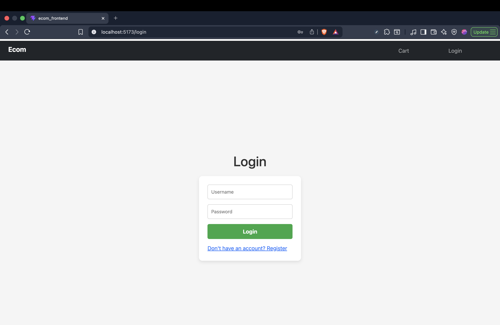
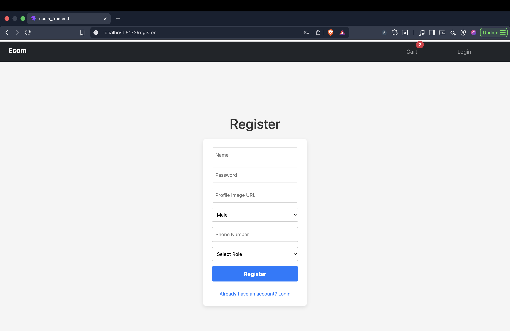
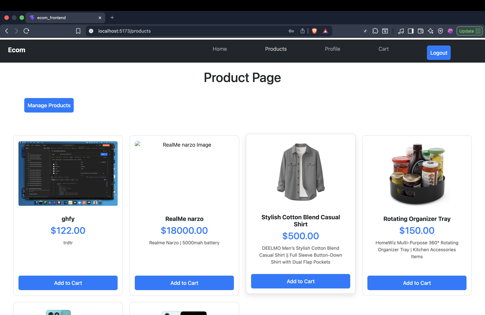
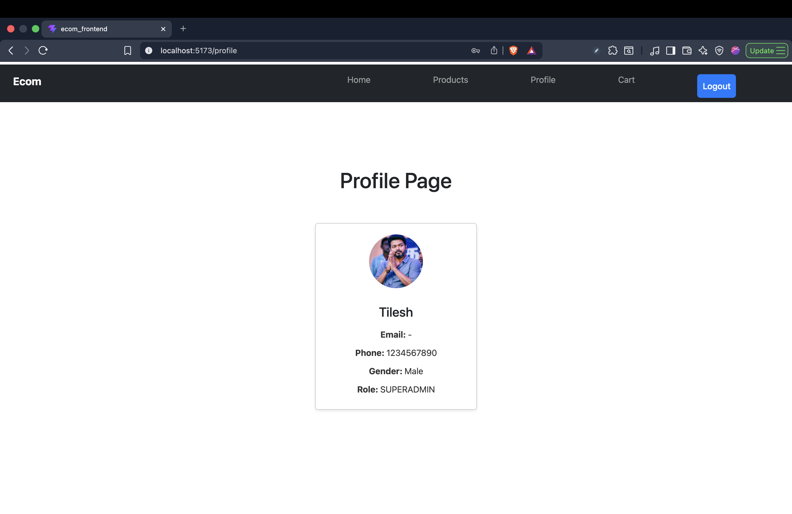
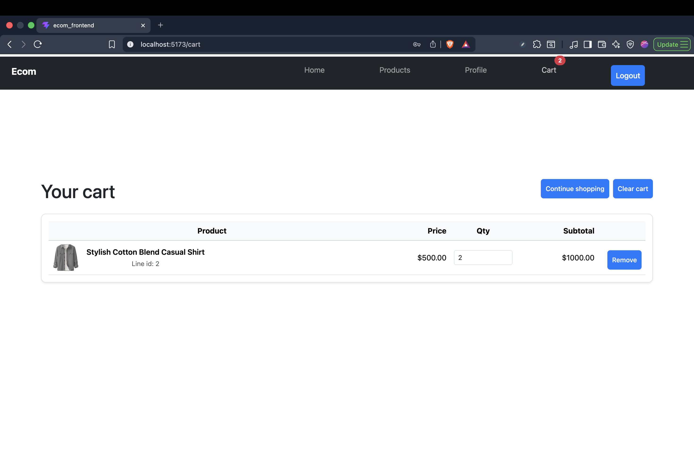

# E‑commerce frontend

React (Vite) storefront UI that talks to a REST API: products, auth, profile, and cart. State for the signed-in user and cart summary lives in **Redux**; the API client attaches the JWT from `localStorage` on each request.

**Backend for this project:** [github.com/Hselit/ecom_backend](https://github.com/Hselit/ecom_backend) — Express API (JWT auth, cart, products, and related routes). Run it locally (see that repo’s readme) so this app can reach it at the `BASE_URL` below.

## Screenshots

Static captures live under [`images/`](images/).

### Login



### Register



### Products



### Profile



### Cart



## Tech stack

- **React 19** + **Vite 8**
- **React Router 7** for routing
- **Redux Toolkit** + **React Redux** for global user and cart state
- **Axios** for HTTP
- **Bootstrap 5** for layout and components

## Prerequisites

- **Node.js** (current LTS recommended)
- The **[ecom_backend](https://github.com/Hselit/ecom_backend)** server running and reachable at the URL in `src/api/config.js` (default `http://localhost:3000`, or whatever port that backend uses)

## Setup and scripts

```bash
npm install
npm run dev      # dev server (see terminal for URL, usually http://localhost:5173)
npm run build    # production build → dist/
npm run preview  # serve the production build locally
npm run lint     # ESLint
```

## API configuration

The Axios instance uses a single base URL:

| File | Purpose |
|------|---------|
| `src/api/config.js` | `BASE_URL` — default `http://localhost:3000` |

All service modules under `src/api/services/` call paths relative to that base (for example `/cart/item`, `/cart`, auth and user routes). Change `BASE_URL` if your API runs on another host or port.

There is no `.env` file in this repo yet. To use environment-specific URLs, you can switch `config.js` to `import.meta.env.VITE_API_URL` and add a `.env` with `VITE_API_URL=...` (see [Vite env variables](https://vite.dev/guide/env-and-mode.html)).

## Auth

- Login stores **`token`** and **`user`** JSON in `localStorage`.
- `src/api/client.js` sends `Authorization: Bearer <token>` when a token exists.
- On app load, `App.jsx` restores the session into Redux if both values are present.

## Routes

| Path | Access | Description |
|------|--------|-------------|
| `/` | Public | Simple home placeholder |
| `/login`, `/register` | Public | Authentication |
| `/products` | **Private** | Product listing |
| `/profile` | **Private** | User profile |
| `/cart` | **Private** | Cart lines, quantity updates, clear cart |
| `/manage-products` | Public (in code) | Product management UI — protect on the server; consider wrapping with `PrivateRoute` + role checks if this should be admin-only |
| `*` | Public | 404 |

**Private** routes use `PrivateRoute`: if Redux has no `user`, the app redirects to `/login`.

## Project layout (high level)

```
src/
  api/
    client.js          # Axios instance + auth header interceptor
    config.js          # API base URL
    services/          # authApi, cartApi, categoryApi, productApi, userApi
  components/          # Navbar, PrivateRoute, …
  pages/               # Login, Register, Product, Profile, Cart, ManageProduct
  redux/store.jsx      # Redux store wiring
  slices/              # userSlice, cartSlice
  utils/               # cart helpers, image URLs, refresh cart → Redux
  App.jsx              # Routes + session restore
  main.jsx             # Root render, Router, Redux Provider
```

## License

Private project (`"private": true` in `package.json`). Adjust this section if you publish or open-source the repo.
